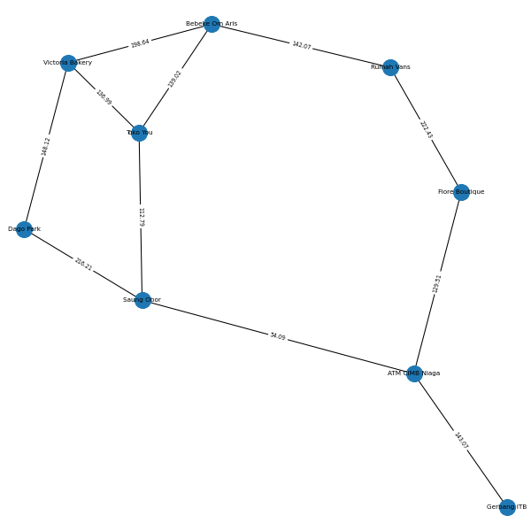
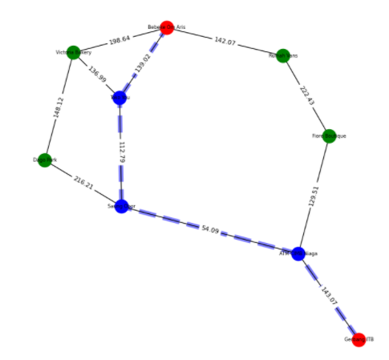
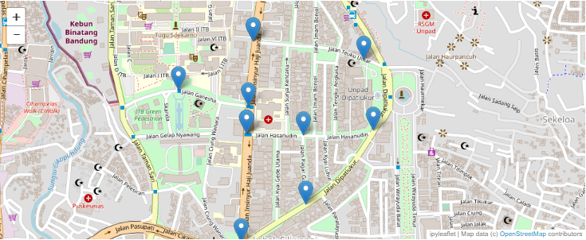
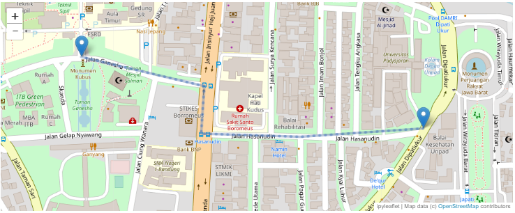

# PathFinder
Tugas Kecil III IF2211 Strategi Algoritma
(Pengaplikasian Algoritma Path Finding A*)

## Penjelasan Singkat Algoritma A*
* Algoritma A*
Algoritma pencarian rute terdekat dengan pendekatan heuristik

## Requirements
* Python (tested on Python 3.8.5)
* Jupyter Notebook on Anaconda3 (tested on conda 4.10, anaconda 1.7.2, and Jupyter Notebook 6.1.4)

## Instalasi
Program dijalankan menggunakan Jupyter Notebook yang disediakan Anaconda dan dapat diunduh pada tautan berikut:  
https://www.anaconda.com/products/individual  
Diperlukan instalasi library networkx, ipyleaflet, dan ipywidgets dalam visualisasi graf dan peta. Untuk library matplotlib, math dan collection seharusnya sudah terinstall bersama Jupyter Notebook.
### Langkah instalasi library 
1. Buka Jupyter Notebook melalui Anaconda3
2. Create new terminal pada jupyter notebook
3. Terminal dapat pula dicari melalui explorer yaitu **Anaconda Prompt**
4. Install library networkx, ipyleaflet, ipywidgets menggunakan conda
```
conda install -c conda-forge ipyleaflet  
conda install -c conda-forge networkx
conda install -c conda-forge ipywidgets
```
5. Untuk ipywidgets biasanya sudah terinstall bersama ipyleaflet

## Cara menggunakan program
1. Clone repository ini
2. Buka file AStarPathFinding pada folder **src** melalui Jupyter Notebook atau Jupyter Lab pada Anaconda
3. Run tiap baris program mulai dari baris paling atas
4. Input nama file sesuai dengan file yang ada pada folder **test**
5. Input node menggunakan nama node yang ditampilkan
6. Visualisai graph, rute dan map perlu dilakukan dengan melakukan run pada baris itu
7. Jika ingin mengubah nama node pada file yang sama, jalankan program mulai dari baris 6 pada Jupyter Notebook
8. Untuk melihat nama simpul pada peta, dapat dilakukan dengan meng-klik marker yang ada pada peta

##Screenshot Program
1. Tampilan visualisasi graf peta sekitar ITB :

2. Tampilan visualisasi graf peta sekitar ITB dari Gerbang ITB ke Bebeke Om Aris :

3. Tampilan map pada peta sekitar ITB :

4. Tampilan map pada peta sekitar ITB dari Gerbang ITB ke Bebeke Om Aris :


## Authors
* Ridho Daffasyah - 13519038
* Thomas Ferdinand Martin - 13519099
